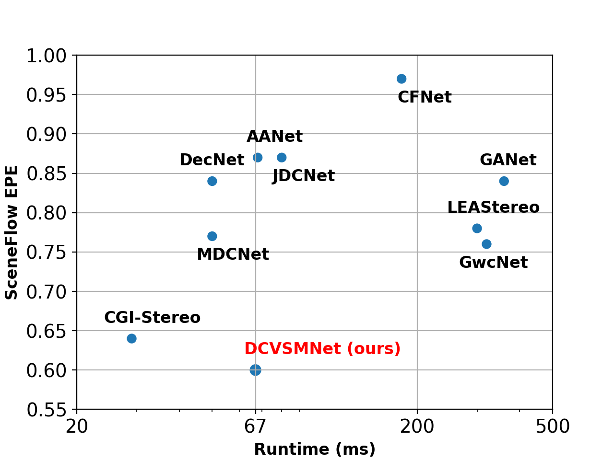

<p align="center">
  <h1 align="center">DCVSMNet: Double Cost Volume Stereo Matching Network</h1>
  <p align="center">
    Mahmoud Tahmasebi* (mahmoud.tahmasebi@research.atu.ie), Saif Huq, Kevin Meehan, Marion McAfee
  </p>
  <h3 align="center"><a href="https://arxiv.org/pdf/2402.16473.pdf">Paper</a>
  <div align="center"></div>
</p>
<p align="center">
  <a href="">
    
  </a>
</p>


# Performance on KITTI raw dataset
<p align="center">
  
</p>


# SOTA results.
The results on SceneFlow

<p align="center"></p>


The results on KITTI dataset using RTX 3090.
| Method | KITTI 2012 <br> (3-noc) | KITTI 2012 <br> (3-all) | KITTI 2015 <br> (D1-bg) | KITTI 2015 <br> (D1-fg) | KITTI 2015 <br> (D1-all) |Runtime <br> (ms)|
|:-:|:-:|:-:|:-:|:-:|:-:|:-:|
| CGI-Stereo | 1.41 % | 1.76 % | 1.66 % | 3.38 % | 1.94 % | 29 |
| CoEx | 1.55 % | 1.93 % | 1.79 % | 3.82 % | 2.13 % | 33 |
| BGNet+ | 1.62 % | 2.03 % | 1.81 % | 4.09 % | 2.19 % | 35 |
| Fast-ACVNet+ | 1.45 % | 1.85 % | 1.70 % | 3.53 % | 2.01 % | 45 |
| HITNet | 1.41 % | 1.89 % | 1.74 % | **3.20 %** | 1.98 % | 54 |
| DispNetC | 4.11 % | 4.65 % | 2.21 % | 6.16 % | 4.43 % | 60 |
| AANet | 1.91 % | 2.42 % | 1.99 % | 5.39 % | 2.55 % | 62 |
| JDCNet | 1.64 % | 2.11 % | 1.91 % | 4.47 % | 2.33 % | 80 |
| **DCVSMNet**| **1.30 %** | **1.67 %** | **1.60 %** | 3.33 % | **1.89 %** | 67 |

The results on SceneFlow dataset based on selected cost volumes.
| Group-wise <br> correlation | Norm <br> correlation  | Concatenation | Group-wise <br> substraction |EPE[px] | D1-all[%] |Runtime <br> (ms)|
|:-:|:-:|:-:|:-:|:-:|:-:|:-:|
| [x] | [x] |     |     | 0.60 | 2.11 | 67 |
| [x] |     | [x] |     | 0.59 | 2.05 | 75 |
| [x] |     |     | [x] | 0.59 | 2.06 | 89 |
|     | [x] | [x] |     | 0.72 | 2.59 | 60 |
|     | [x] |     | [x] | 0.65 | 2.28 | 74 |
|     |     | [x] | [x] | 0.69 | 2.38 | 81 |

# How to use

## Environment
* NVIDIA RTX 3090
* Python 3.8
* Pytorch 1.12

## Install

### Create a virtual environment and activate it.

```
conda create -n DCVSMNet python=3.8
conda activate DCVSMNet
```
### Dependencies

```
conda install pytorch torchvision torchaudio cudatoolkit=11.3 -c pytorch -c nvidia
pip install opencv-python
pip install scikit-image
pip install tensorboard
pip install matplotlib 
pip install tqdm
pip install timm==0.5.4
```

## Data Preparation
* [SceneFlow Datasets](https://lmb.informatik.uni-freiburg.de/resources/datasets/SceneFlowDatasets.en.html)
* [KITTI 2012](http://www.cvlibs.net/datasets/kitti/eval_stereo_flow.php?benchmark=stereo)
* [KITTI 2015](http://www.cvlibs.net/datasets/kitti/eval_scene_flow.php?benchmark=stereo)
* [Middlebury](https://vision.middlebury.edu/stereo/submit3/)

## Train

Use the following command to train DCVSMNet on SceneFlow.
First training,
```
python train_sceneflow.py --logdir ./checkpoints/sceneflow/first/
```
Second training,
```
python train_sceneflow.py --logdir ./checkpoints/sceneflow/second/ --loadckpt ./checkpoints/sceneflow/first/checkpoint_000059.ckpt
```

Use the following command to finetune DCVSMNet on KITTI using the pretrained model on SceneFlow,
```
python train_kitti.py --logdir ./checkpoints/kitti/ --loadckpt ./checkpoints/sceneflow/second/checkpoint_000059.ckpt
```


## Evaluation on SceneFlow and KITTI

### Pretrained Model
* [DCVSMNet](https://drive.google.com/drive/folders/1VcfEpO9Mv0Bt7Xdvckii4SAavW8cL1_d)

Generate disparity images of KITTI test set,
```
python save_disp.py
```

# Citation

If you find this project helpful in your research, welcome to cite the paper.

```
@misc{tahmasebi2024dcvsmnet,
      title={DCVSMNet: Double Cost Volume Stereo Matching Network}, 
      author={Mahmoud Tahmasebi and Saif Huq and Kevin Meehan and Marion McAfee},
      year={2024},
      eprint={2402.16473},
      archivePrefix={arXiv},
      primaryClass={cs.CV}
}
```

# Acknowledgements

Thanks to open source works: [CoEx](https://github.com/antabangun/coex), [ACVNet](https://github.com/gangweiX/Fast-ACVNet), [CGI-Stereo](https://github.com/gangweiX/CGI-Stereo).
